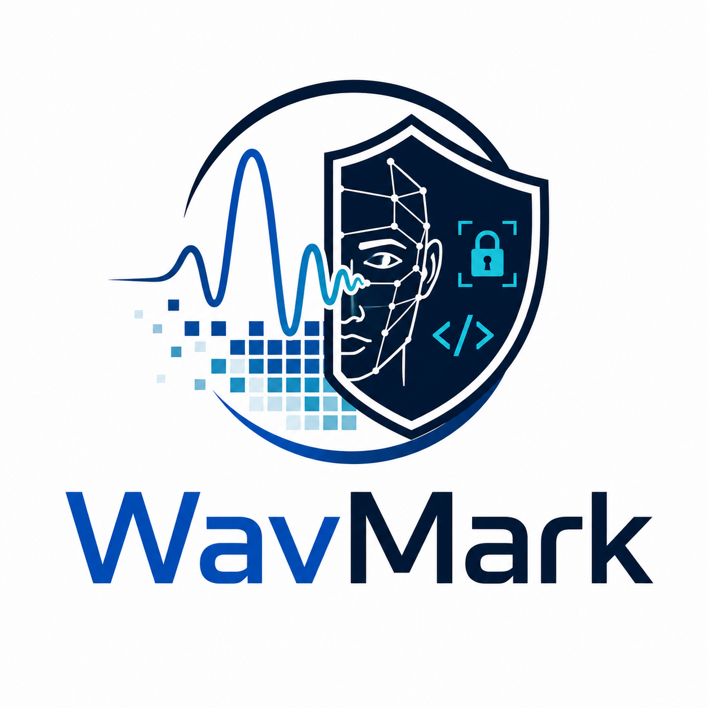
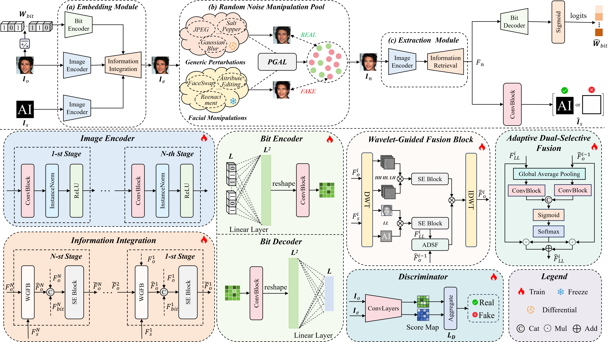

# WavMark: Wavelet Transform-Based Versatile Watermarking for Facial Manipulation Source Tracing and Detection

<p align="center">
  
</p>

<p align="center">
  <b>A proactive forensic framework for robust source tracing and facial manipulation detection.</b>
</p>

<p align="center">
  <a href="#"></a>
  <a href="#"></a>
  <a href="#"></a>
  <a href="#"></a>
</p>

---

## 📌 Overview

**WavMark** is a wavelet-transform-based proactive forensic watermarking framework designed for **facial manipulation source tracing** and **facial manipulation detection**.

Unlike conventional passive deepfake detection methods that identify forged content after manipulation, WavMark embeds forensic information into the original facial image before dissemination. The embedded watermark supports:

- **Robust bit watermark recovery** for source tracing and copyright verification.
- **Semi-fragile image watermark recovery** for facial manipulation detection.
- **Generic perturbation robustness** against common image operations such as compression, blur, noise, resizing, and color transformation.
- **Facial manipulation sensitivity** against face swapping, reenactment, and attribute editing.

The framework jointly considers imperceptibility, robustness, and semi-fragility in a unified end-to-end training pipeline.

---

## 🔥 Key Features

- ✅ **Dual watermarking mechanism**: jointly embeds a robust bit watermark and a semi-fragile image watermark.
- ✅ **Wavelet-guided feature fusion**: uses frequency-domain modeling to distinguish generic perturbations from semantic facial manipulation.
- ✅ **End-to-end training and testing**: supports training, validation, checkpoint saving, and testing in a unified pipeline.
- ✅ **Multiple manipulation layers**: supports common perturbations and deepfake-style manipulation layers.
- ✅ **Automatic metric reporting**: reports BCR, PSNR, SSIM, and LPIPS for quantitative evaluation.

---

## 🧩 Framework



---

## 📁 Repository Structure

```text
WavMark/
├── assets/
│   ├── logo.png
│   ├── framework.png
├── checkpoints/
│   └── your_checkpoint.tar
├── data/
│   ├── CelebAHQ_256.csv
│   └── secret_image/
│       └── BlackWhite256.jpg
├── module/
│   ├── DualMark.py
│   ├── noise_layers/
│   │   ├── common_manipulation/
│   │   └── deepfake/
│   └── pretrained_models/
├── log/
├── results/
├── utils/
│   ├── metrics.py
│   └── utils.py
├── dataset.py
├── option.py
├── main.py
├── train.py
├── test.py
├── requirements.txt
└── README.md
```

---

## ⚙️ Installation

### 1. Clone the repository

```bash
git clone https://github.com/your-name/WavMark.git
cd WavMark
```

### 2. Create a virtual environment

```bash
conda create -n wavmark python=3.8 -y
conda activate wavmark
```

### 3. Install dependencies

```bash
pip install -r requirements.txt
```

If you do not have a `requirements.txt` file yet, you can start with:

```bash
pip install torch torchvision torchaudio
pip install opencv-python pillow numpy tqdm kornia lpips thop visdom
```

Optional dependencies may be required by specific facial manipulation modules such as SimSwap, StarGAN, HiSD, GANimation, InfoSwap, DiffAE, or DiffusionCLIP. Please install the dependencies required by the corresponding manipulation model before enabling it.

---

## 📦 Data Preparation

### 1. Dataset CSV Format

WavMark loads images through a CSV file. The CSV file should contain at least the following columns:

```csv
name,image,split
000001,/path/to/image_000001.png,train
000002,/path/to/image_000002.png,validate
000003,/path/to/image_000003.png,test
```

Field description:

| Field | Description |
|---|---|
| `name` | Image name or image ID |
| `image` | Absolute or relative path to the facial image |
| `split` | Dataset split: `train`, `validate`, or `test` |

The dataset loader selects samples according to the split field:

| State | Split |
|---:|---|
| `0` | `train` |
| `1` | `validate` |
| `2` | `test` |

### 2. Secret Image

The semi-fragile image watermark is loaded from:

```bash
data/secret_image/BlackWhite128.jpg
```

or:

```bash
data/secret_image/BlackWhite256.jpg
```

You can specify the secret image path using:

```bash
--secret_image_path data/secret_image/BlackWhite256.jpg
```

### 3. Recommended Dataset Layout

```text
data/
├── CelebAHQ_256.csv
├── secret_image/
│   └── BlackWhite256.jpg
└── images/
    ├── 000001.png
    ├── 000002.png
    └── ...
```
### 4. Checkpoint Download

For your convenient usage, we prepare the weights download link in [Google Drive](https://drive.google.com/file/d/1TQUFE9tycLaxMGVW4cnV_0FvaZ3lTjxN/view?usp=sharing).

---

## 🚀 Quick Start

### Train

```bash
python main.py \
  --status 0 \
  --csv_file_path data/CelebAHQ_256.csv \
  --secret_image_path data/secret_image/BlackWhite256.jpg \
  --resolution 256 \
  --message_length 128 \
  --batch_size 16 \
  --epoch 200 \
  --lr 0.0001 \
  --gpus cuda:0
```

### Test

```bash
python test.py \
  --csv_file_path data/CelebAHQ_256.csv \
  --secret_image_path data/secret_image/BlackWhite256.jpg \
  --checkpoint_path checkpoints/your_checkpoint.tar \
  --resolution 256 \
  --message_length 128 \
  --batch_size 1 \
  --gpus cuda:0
```

---

## 🏋️ Training

The training entry is `main.py`. Set `--status 0` to enable training mode.

```bash
python main.py --status 0
```

During training, the program performs the following steps:

1. Load the training and validation datasets from the CSV file.
2. Load the original facial image and the secret image watermark.
3. Randomly generate binary bit messages.
4. Embed the image watermark and bit watermark into the original image.
5. Apply selected common perturbation or facial manipulation layers.
6. Decode the image watermark and bit watermark.
7. Optimize encoder, decoder, and discriminator losses.
8. Evaluate PSNR, SSIM, and bit error rate on the validation set.
9. Save checkpoints when validation quality satisfies the checkpoint condition.

### Important Training Arguments

| Argument | Description | Example |
|---|---|---|
| `--status` | Running mode. `0` for training, `1` for testing | `0` |
| `--csv_file_path` | Path to dataset CSV file | `data/CelebAHQ_256.csv` |
| `--secret_image_path` | Path to image watermark | `data/secret_image/BlackWhite256.jpg` |
| `--checkpoint_path` | Path to pretrained or resumed checkpoint | `checkpoints/model.tar` |
| `--batch_size` | Batch size | `16` |
| `--epoch` | Number of training epochs | `200` |
| `--message_length` | Length of the bit watermark | `128` |
| `--resolution` | Image resolution | `256` |
| `--lr` | Learning rate | `0.0001` |
| `--workers` | Number of dataloader workers | `4` |
| `--gpus` | GPU device | `cuda:0` |

### Training with Common Perturbations

Common perturbation layers can be configured in `option.py` through `noise_layers_C`.

Examples:

```python
[
    'Identity(args)',
    'Dropout(args)',
    'DifferentialJpeg(args)',
    'Resize(args)',
    'GaussianBlur(args)',
    'MedianBlur(args)',
    'Brightness(args)',
    'Contrast(args)',
    'Saturation(args)',
    'Hue(args)',
    'SaltPepper(args)',
    'GaussianNoise(args)'
]
```

### Training with Facial Manipulation Layers

Facial manipulation layers can be configured in `option.py` through `noise_layers_D`.

Examples:

```python
[
    'StarGAN(args)',
    'AttGAN(args)',
    'SimSwap(args)',
    'HiSD(args)',
    'InfoSwap(args)',
    'GANimation(args)',
    'UniFaceSwap(args)',
    'UniFaceReen(args)',
    'HyperReenact(args)'
]
```

Before enabling a specific facial manipulation layer, make sure that its pretrained model and configuration path are correctly set in `option.py`.

### Visualization with Visdom

The training script supports Visdom visualization.

Start the Visdom server:

```bash
python -m visdom.server
```

Then open:

```text
http://localhost:8097
```

Training curves include:

- Train loss
- Validation loss
- PSNR
- SSIM
- Bit error rate

---

## 🧪 Testing

The testing entry is  `test.py`. Set `--status 1` to enable testing mode.

```bash
python test.py
```

The testing procedure includes:

1. Load test images from the CSV file.
2. Load the trained checkpoint.
3. Generate random bit messages.
4. Embed watermarks into the original images.
5. Apply the configured perturbation or facial manipulation layer.
6. Decode the bit watermark and image watermark.
7. Calculate quantitative metrics.
8. Save visual results.

### Example Testing Command

```bash
python test.py \
  --csv_file_path data/CelebAHQ_256.csv \
  --checkpoint_path checkpoints/epoch_xxx.tar \
  --secret_image_path data/secret_image/BlackWhite256.jpg \
  --resolution 256 \
  --message_length 128 \
  --batch_size 1
```

### Testing with a Specific Manipulation

To test under `SimSwap`, set `noise_layers_D` in `option.py`:

```python
parser.add_argument('--noise_layers_D', type=list, default=[
    'SimSwap(args)'
])
```

Then run:

```bash
python test.py
```

To test under a common perturbation such as JPEG compression, set `noise_layers_C`:

```python
parser.add_argument('--noise_layers_C', type=list, default=[
    'DifferentialJpeg(args)'
])
```

and keep `noise_layers_D` empty.

---

## 📊 Evaluation Metrics

WavMark reports the following metrics:

| Metric | Meaning |
|---|---|
| `BCR` | Bit Correct Rate. Higher is better. |
| `PSNR` | Peak Signal-to-Noise Ratio between original and encoded images. Higher is better. |
| `SSIM` | Structural Similarity between original and encoded images. Higher is better. |
| `LPIPS` | Perceptual distance between original and encoded images. Lower is better. |
| `Error Rate` | Bit decoding error rate. Lower is better. |

The test script computes:

```text
BCR = (1 - error_rate) × 100
```

---

## 🖼️ Output Results

During validation and testing, generated images are saved to the `results/` directory.

A typical result directory is:

```text
results/
└── CelebAHQ/
    └── 256/
        ├── common/
        │   └── Identity/
        │       ├── OI/
        │       ├── EI/
        │       ├── NI/
        │       └── SI/
        └── deepfake/
            └── SimSwap/
                ├── OI/
                ├── EI/
                ├── NI/
                └── SI/
```

Folder meaning:

| Folder | Description |
|---|---|
| `OI` | Original images |
| `EI` | Encoded images |
| `NI` | Noised or manipulated images |
| `SI` | Decoded secret image watermarks |

---

## 📚 Citation

If this code is helpful for your research, please cite:

```bibtex
@article{zhang2026wavmark,
  title   = {Wavelet transform-based versatile watermarking for facial manipulation source tracing and detection},
  author  = {Zhang, Yibo and Lin, Weiguo and Xu, Junfeng and Shi, Lei and Xu, Wanshan and Xu, Yikun and Kou, Feifei},
  journal = {Information Processing and Management},
  volume  = {63},
  pages   = {104852},
  year    = {2026},
  publisher = {Elsevier}
}
```

---

## 📄 License

This project is released under the MIT License.

Please check the licenses of third-party models and datasets before using them for commercial purposes.

---

## 🙏 Acknowledgements

This repository is built for research on proactive forensics, digital watermarking, and facial manipulation detection.

We thank the authors and contributors of related open-source projects and datasets, including deep watermarking, face manipulation, and image forensics communities.
